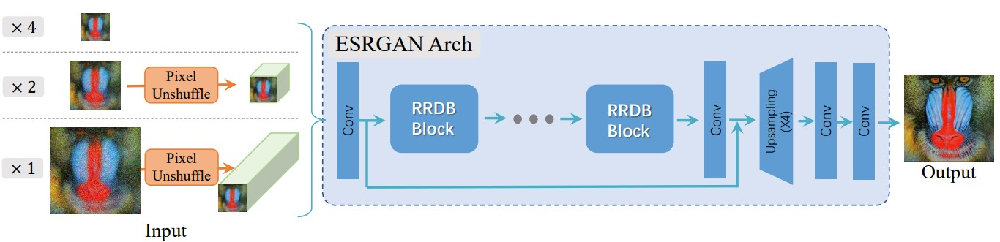

# Real-ESRGAN 飞桨特色模型挑战赛

Real-ESRGAN: Training Real-World Blind Super-Resolution with Pure Synthetic Data

官方源码：[https://github.com/xinntao/Real-ESRGAN](https://github.com/xinntao/Real-ESRGAN)

原Paddle复现地址：[https://github.com/20151001860/Real_ESRGAN_paddle](https://github.com/20151001860/Real_ESRGAN_paddle)

**轻量化模型复现地址**：[https://github.com/sldyns/Real-ESRGAN_paddle_Lite](https://github.com/sldyns/Real-ESRGAN_paddle_Lite)

## 1. 简介



本项目基于深度学习框架PaddlePaddle对Real-ESRGAN网络进行复现。Real-ESRGAN网络属于生成对抗网络，包括基于ESRGAN的生成器和基于U-Net的判别器，可对真实世界的复杂图像进行超分辨率重建。

本项目对Real-ESRGAN进行轻量化，使用9个RRDB block并从头训练模型（原代码为23个block），在模型大小和推理速度方面均达到复现要求.

### 对Paddle的复现项目的修正

- Paddle的复现项目没有先训练Real-ESRNet，而是直接训练了Real-ESRGAN模型，与作者的代码不一致，本项目遵照作者提供的[训练文档](https://github.com/xinntao/Real-ESRGAN/blob/master/docs/Training.md)进行训练；
- Paddle的复现项目没有实现**High order degradation**，推测是由于paddlepaddle-2.2版本不支持Poisson采样，这一问题导致图像仍较模糊；而2.3版本提供了该API，于是本项目复现High order degradation；
- Paddle的复现项目复现的U-Net判别器与作者的BasicSR的不一致，本项目已修复此问题；
- Paddle的复现项目复现的Perceptual Loss存在问题，这导致了图像颜色的不一致，本项目使用ppgan的PerceptualLoss，修复了此问题；

### 待完善的内容

- 由于该轻量化模型仅使用了9个RRDB block，因此效果上有一定降低（不过较Paddle的复现项目好），可能需要增加数据集和训练时间；
- 将代码改为可多卡运行的版本，但由于`paddle.random`导致报错`CUDA error(700)`，具体原因尚不清楚，待进一步修复；

## 3. 复现效果

使用以下4张图像的可视化作为验收数据集：

| 原始图像                                         | 争先赛验收可视化要求                                         | 本项目可视化结果                                          | 争先赛验收推理速度要求(s/帧) | 本项目推理速度(s/帧) |
| ------------------------------------------------ | ------------------------------------------------------------ | --------------------------------------------------------- | ---------------------------- | -------------------- |
|                  |                        |                        | 0.33                         | 0.20                 |
|                   |                          |                          | 0.12                         | 0.06                 |
|                           |                          |                          | 0.12                         | 0.07                 |
|  |  |  | 0.14                         | 0.10                 |


## 3. 数据集、预训练模型、文件结构

### 数据集

本项目训练所用的数据集为`DF2K`、`DF2K_multiscale`、`OST`（前几个为作者所用的数据集）和420张动漫图像（用于提升动漫图片的超分效果），Ai Studio地址如下：

- DF2K和DF2K_multiscale：https://aistudio.baidu.com/aistudio/datasetdetail/119372，解压放在`datasets`文件夹中；
- OST：https://aistudio.baidu.com/aistudio/datasetdetail/151200，使用其中7类数据，解压后将文件夹内图片统一放到`datasets/OST_train`文件夹中
- 动漫图像，已存放在本项目中，解压放在`datasets`文件夹中；

将所有数据对应解压到datasets中，使用以下脚本生成meta_info文件：

```shell
python tools/generate_meta_info.py --input datasets/DF2K_HR datasets/DF2K_multiscale datasets/AnimeSR/ datasets/OST_train/ --root datasets/ datasets/ datasets/ datasets/ --meta_info datasets/meta_info_DF2Kmultiscale_Anime_OST.txt
```

### 预训练模型

百度网盘：[下载链接](https://pan.baidu.com/s/1dDJqe8dxowbXtMGAiah8Tg)，提取码：f36m 

1. 官方预训练模型，已转为 paddle 的，名为 `ESRGAN_SRx4_DF2KOST_official-ff704c30.pdparams`，放在文件夹 `experiments/pretrained_models` 下；
2. Real-ESRNet模型，名为 `net_g_65000.pdparams`；
3. Real-ESRGAN模型，名为 `net_g_56000.pdparams`；
4. 导出的模型参数包括 `inference.pdmodel` 和 `inference.pdiparams`；

### 文件结构

```
Real-ESRGAN_paddle_Lite
    |-- data                       # 数据集相关文件
    |-- experiments                # 实验路径
    |-- logs                       # 训练日志
    |-- inputs                     # 测试数据
    |-- loss                       # 损失函数
    |-- models                     # 模型相关文件
    |-- options                    # 训练配置文件
    |-- results                    # 测试输出结果
    |-- results_infer              # 推理模型输出结果
    |-- test_tipc                  # TIPC: Linux GPU/CPU 基础训练推理测试
    |-- tools                      # 一些工具代码
    |-- utils                      # 一些工具代码
    |-- README.md                  # README.md文件
    |-- train.py                   # 训练代码
```

## 4. 环境依赖

- PaddlePaddle >= 2.3.0
- ppgan
- opencv-python

## 5. 快速开始

### 单卡训练(V100-32G)

1. 使用原论文的初始化模型参数`ESRGAN_SRx4_DF2KOST_official-ff704c30.pdparams`进行训练.

2. 遵照原论文的方式，首先训练 Real-ESRNet，修改配置文件`options/train_realesrnet_x4plus.yml` ：

   ```
   datasets:
     train:
       name: DF2K_Anime_OST
       type: RealESRGANDataset
       dataroot_gt: datasets
       meta_info: datasets/meta_info_DF2Kmultiscale_Anime_OST.txt
       io_backend:
         type: disk
   ```

3. 训练 Real-ESRNet：

   ```
   python train.py --yml_path options/train_realesrnet_x4plus.yml
   ```

4. 训练完Real-ESRNet后，准备训练Real-ESRGAN，修改配置文件`options/train_realesrgan_x4plus.yml` ：

   ```
   path:
     # use the pre-trained Real-ESRNet model
     pretrain_network_g: experiments/train_RealESRNetx4plus_1000k_B9G4/models/net_g_65000.pdparams
   ```

​	注：此处Real-ESRNet只训练了65000个iteration.

5. 训练Real-ESRGAN：

   ```
   python train.py --yml_path options/train_realesrnet_x4plus.yml
   ```

### 模型测试

使用训练了56000个iteration的模型进行测试

```shell
python tools/predict.py --input inputs --output results --model_path experiments/train_RealESRGANx4plus_400k_B9G4/models/net_g_56000.pdparams --block 9
```

输出图片在 `results`文件夹下.

### 模型导出

模型动转静导出：

```shell
python tools/export_model.py --model-dir ./experiments/train_RealESRGANx4plus_400k_B9G4/models/net_g_56000.pdparams --save-inference-dir ./infer/ --block 9
```

最终在`infer/`文件夹下会生成下面的3个文件：

```
infer
  |----inference.pdiparams     : 模型参数文件
  |----inference.pdmodel       : 模型结构文件
  |----inference.pdiparams.info: 模型参数信息文件
```

注：Real-ESRGAN Lite 模型总大小为 28.2 Mb < 30 Mb.

### 模型推理

```shell
python tools/infer.py --input inputs --output results_infer --model_path ./infer
```

输出图片在 `results_infer`文件夹下

## 6. TIPC

首先安装AutoLog（规范化日志输出工具）

```
pip install  https://paddleocr.bj.bcebos.com/libs/auto_log-1.2.0-py3-none-any.whl
```

在linux下，进入 Real-ESRGAN_paddle_Lite 文件夹，运行命令：

```shell
bash test_tipc/prepare.sh ./test_tipc/configs/Real_ESRGAN/train_infer_python.txt 'lite_train_lite_infer'
bash test_tipc/test_train_inference_python.sh ./test_tipc/configs/Real_ESRGAN/train_infer_python.txt 'lite_train_lite_infer'
```

## 7. LICENSE

本项目的发布受[Apache 2.0 license](https://github.com/PaddlePaddle/models/blob/release/2.2/community/repo_template/LICENSE)许可认证


